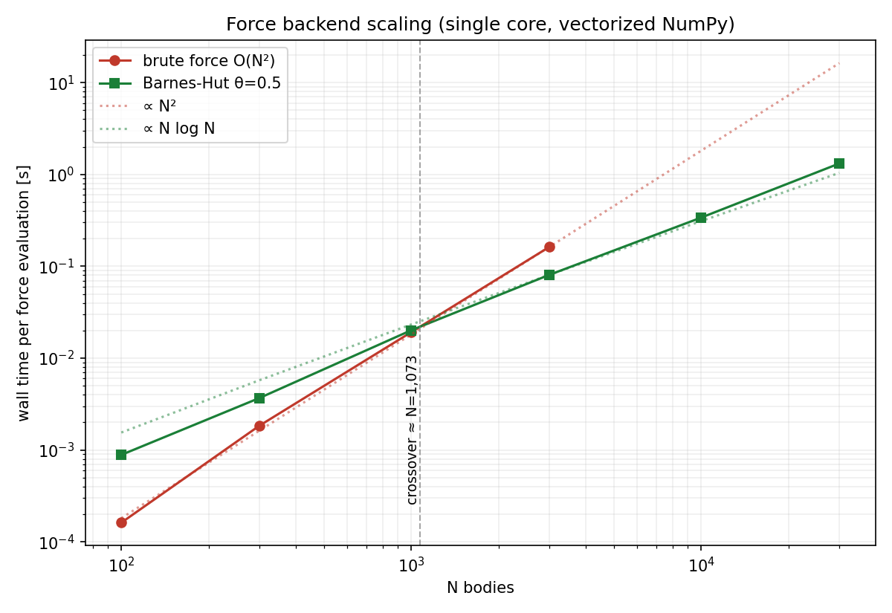
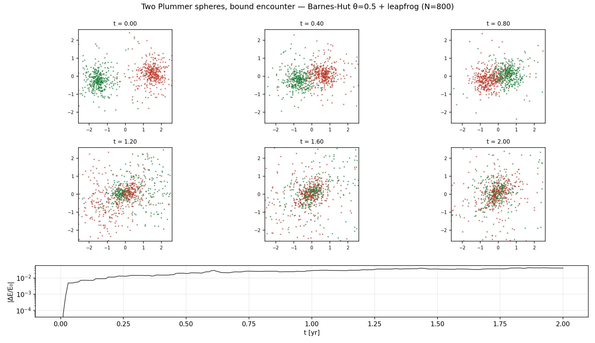

# nbody-sim

Gravitational N-body simulator built **spec-first**: every physical claim in
[SPEC.md](SPEC.md) is enforced by a test, and every figure below is regenerated by a
committed script. Pure NumPy — the Barnes-Hut octree is fully vectorized (no per-body
recursion), which is the project's main engineering trick.

**Live demo:** interactive trajectory player on GitHub Pages (`visualization/`,
deployed by CI) — or run `make serve` locally.

## What's inside

- **Integrators:** symplectic leapfrog (KDK), symplectic Euler-Cromer, RK4 — the full
  2×2 matrix of (symplectic × order), with measured convergence slopes 2.00 / 1.00 / 4.00.
- **Forces:** brute O(N²) (broadcast, N ≤ 3000 by memory contract) and Barnes-Hut
  O(N log N): level-synchronous octree build on octant keys + frontier-batched walk,
  both pure array programs.
- **Physics as tests (30 green):** energy band vs secular drift, Kepler orbit elements,
  Newton's third law, exact P/L conservation to roundoff, BH-vs-brute error percentiles
  and its ~θ³ scaling law, Plummer sampler virial ratio.
- **Player:** zero-dependency single-file HTML (canvas, LERP on typed arrays, pan/zoom,
  T/V/E chart with synced cursor, escaper highlighting).

## Results

| | |
|---|---|
|  | **Symplectic band vs secular drift.** Leapfrog's energy error stays in a bounded band forever; RK4 (higher order!) drifts linearly. Predicted crossover from a 300-orbit run: ≈7.4k orbits; validated empirically at cheaper parameters: predicted ≈1100, observed 1106. |
|  | **Backend scaling.** Barnes-Hut overtakes brute force at N ≈ 1.1k; at N = 30k brute force would need ~22 GB while BH runs in 1.3 s/eval. |
|  | **Two-Plummer bound encounter** (N=800, θ=0.5): first passage, violent relaxation with tidal ejecta, merged remnant. The JSON history of this run feeds the player. |

## Quickstart

```bash
make install   # pip install -e ".[dev]"
make test      # 30 physics tests
make simulate  # regenerate the collision + player data
make serve     # player at http://localhost:8000
```

Docker (no local Python needed):

```bash
make docker-build
make docker-run                                   # default: cluster collision
docker run --rm nbody-sim benchmarks/bench_scaling.py   # any script override
```

Full reproduction of every figure: `make figures` (~2 min single-core).

## Repository layout

```
src/nbody/        bodies · forces · barnes_hut · integrators · diagnostics · sim
tests/            the executable physics contract (SPEC §5)
experiments/      energy drift · cluster collision · final figures
benchmarks/       scaling + cProfile/A-B profiling harness
visualization/    single-file player (GitHub Pages root)
SPEC.md           architecture contract + engineering changelog (v0.1 → v0.6)
```

## Method

The workflow this repo demonstrates: SPEC before code, tests calibrated then frozen,
hypotheses settled by measurement (two were falsified along the way — see the 0.4
changelog entry), and honest documentation of every trade-off (softening consistency,
BH momentum non-conservation, coarse-dt energy budget in the merger).
