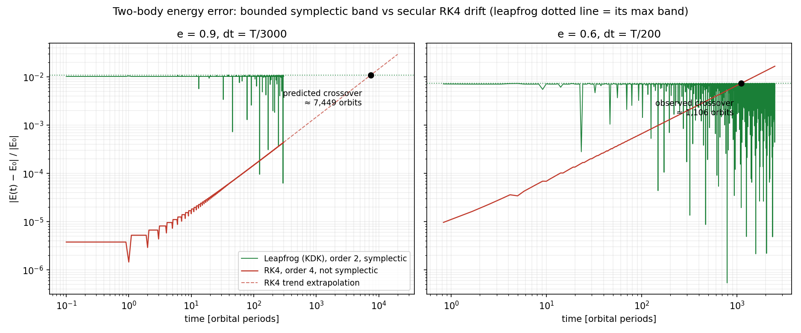

# Building an N-Body Simulator in 7 Days: Spec-First Engineering with an AI Pair-Engineer

*How I directed a week-long computational physics project — symplectic integrators,
a fully vectorized Barnes-Hut, and a test suite that enforces physics — and what three
falsified hypotheses taught me about trusting measurements over intuition.*

---

## How this was built (read this first)

Full transparency, because it's the most interesting part: I built this project in a
week by directing an AI pair-engineer (Claude) through a strict spec-first workflow.
My role was the one that doesn't compress: choosing the project, approving the
architecture contract ([SPEC.md](../SPEC.md)) before any code existed, verifying the
derivations on paper (softened potential gradient, vis-viva, why kick-drift-kick is
exact for each half of the Hamiltonian), making every design decision on the record,
and refusing to let a single claim into the README without a test or a figure behind it.

The rule that made it work: **the SPEC is a contract, tests are its enforcement, and
the changelog records every hypothesis we got wrong.** What follows are the three
times we were wrong, with numbers — because that changelog turned out to be the most
valuable artifact in the repo.

## The problem

Gravitational N-body simulation is a brutal fit for Python. The physics is O(N²) per
step in its naive form, the integration needs millions of steps, and the interpreter
charges ~microseconds per operation where C charges nanoseconds. The standard answers
are "rewrite it in C++" or "sprinkle numba on it." We took a third path: make every
phase of the computation — including the octree — a pure array program, so NumPy's
C kernels do all the per-body work.

Three integrators (leapfrog KDK, symplectic Euler, RK4 — the full 2×2 matrix of
*symplectic × order*), two force backends (brute-force broadcasting and Barnes-Hut),
30 tests that assert physics, a container, CI, and a zero-dependency
[interactive trajectory player](../visualization/player.html). Everything below is
reproducible with `make figures`.

## A Barnes-Hut without recursion

The textbook Barnes-Hut walks an octree recursively per body. In Python that costs
one interpreter-level call per (body, node) visit — at N=10⁴, millions of them per
step, slower than vectorized brute force. So the tree here is built and walked
*level-synchronously*:

- **Build:** every body carries an integer octant-path key; each depth appends a
  3-bit digit. `np.unique`-style grouping (one `argsort`, boundaries, `bincount`)
  turns bodies into cells and aggregates cell mass and center of mass; child links
  fall out of `searchsorted` on the next level's parent keys.
- **Walk:** a frontier of (target, node) pairs — all bodies start at the root —
  processed one level per iteration: accepted nodes contribute monopoles,
  leaves resolve exact softened pairs, rejected pairs expand to children via the
  ragged-expansion idiom:

```python
def _ragged_arange(counts):
    ends = np.cumsum(counts)
    return np.arange(int(counts.sum())) - np.repeat(ends - counts, counts)

fn = np.repeat(tree.child_start[rn], c) + _ragged_arange(c)   # all children, no loop
fb = np.repeat(rb, c)
```

θ=0 degenerates to exact pairwise summation and must match brute force to
summation-order roundoff — that equivalence is a test, not a hope.

## War story #1: the convergence test that lied

First red tests of the project: leapfrog measured convergence order **4.002**
(expected 2), RK4 measured **4.979** (expected 4). The implementation was correct;
the *measurement* was broken.

We had started the harmonic-oscillator test at `x = X0, v = 0` and measured
`|x - x_exact|` after exactly one period. Both integrators have (near-)exact
amplitude there and a pure phase error Δφ — and at an extremum of cosine, phase
enters *quadratically*: `err ≈ 1 - cos(Δφ) ≈ Δφ²/2`. Leapfrog's O(dt²) phase error
masquerades as O(dt⁴). RK4 shows the superconvergence of a symmetric point.

The fix: measure at a generic phase (0.85 T) on the full state norm
`√(Δx² + (Δv/ω)²)`, where phase error enters linearly. Orders snapped to 2.00 / 4.00
(and 1.00 for symplectic Euler). The broken version is documented in the test's
docstring — a degenerate measurement point is a bug class worth remembering.

## War story #2 and #3: two profiling hypotheses, both wrong

**Hypothesis A** (mine going in): *the tree build is dominated by sorting; kill the
double sort.* We did make the grouping 2.52× faster — one `argsort` instead of
`np.unique` + a second sort, with the sort order reused for the leaf CSR. Then the
profiler delivered the verdict: the build is **2%** of a force evaluation. Sorting is
**1%** of the run. The walk owns **75.1%**. A real optimization with a marginal
impact — shipped, but humbling.

**Hypothesis B** (the obvious next move): *bigger leaf buckets will speed up the walk*
— fewer levels, fewer frontier expansions. The sweep said otherwise:

| leaf_size | time @ N=3000 | p99 force error |
|---:|---:|---:|
| 1 | **144.6 ms** | 1.51e-2 |
| 8 | 213.2 ms | 5.79e-3 |
| 64 | 313.7 ms | **2.76e-3** |

Bigger buckets *slow it down* (each target does exact pairwise work against whole
buckets faster than levels disappear) while *improving accuracy*. So `leaf_size`
shipped as an accuracy dial, not a speed knob — the opposite of the plan. The real
hotspot (fancy-indexing allocations in the frontier loop) is documented as future
work rather than blindly "optimized."

Bonus falsification: BH force error scales ~**θ³** here, not the textbook (s/d)² —
measuring distance to the center of mass kills the dipole term. Median error at
θ=0.5: 5.3e-3; we also learned to never use `max` as the error metric, because
relative error explodes on bodies whose net force nearly cancels (15% on one
cluster-edge body, pure cancellation geometry).

## The prediction that landed: 1,100 vs 1,106

The flagship physics claim — symplectic leapfrog's energy error stays in a bounded
band while RK4's *higher-order* error drifts secularly — needed a crossover
demonstration. At e=0.9, dt=T/3000, the crossover extrapolated to ≈7,400 orbits:
13 CPU-minutes we didn't have in the session budget.

So we treated it like an experimental physics problem: validate the extrapolation
method at cheaper parameters. A 200-orbit pilot at e=0.6, dt=T/200 predicted
crossover at ~1,100 orbits; the full 2,500-orbit run observed it at **1,106**.
The leapfrog band, meanwhile, was identical at orbit 200 and orbit 2,500 —
the shadow-Hamiltonian story, empirically flat.



## Frontend: 60 fps from a JSON file, zero dependencies

The player is one HTML file. The tricks that matter:

- **Zero-allocation rendering.** Trajectories parse once into a flat `Float64Array`
  (`pos[(k·n + i)·3 + c]`); each animation frame LERPs between two samples into a
  *preallocated* scratch buffer. No objects, no GC pauses.
- **CORS without a server.** `fetch()` of local JSON dies on `file://`, so the
  loading chain is: try `fetch` (works on GitHub Pages) → drag-and-drop → file
  picker. Double-click the file, drop the data, it plays.
- **Velocities that aren't there.** The schema ships positions only, so escaper
  highlighting estimates per-body speed by central differences between samples —
  a documented coarse-graining — and flags anything above 4× the frame's *median*
  (robust against the very tail it's trying to find).

## What I actually learned

1. **Profile before optimizing — and expect to be wrong.** Two out of two
  optimization hypotheses were falsified by measurement. The discipline isn't
  "have better intuition," it's "make the measurement cheap enough that intuition
  never ships unverified."
2. **Degenerate measurement points are a bug class.** A test can pass or fail for
  reasons that live entirely in *how* you measure.
3. **Spec-first works with an AI pair-engineer** — but only with a human who reads
  the derivations, owns the decisions, and keeps a changelog of failures. The AI
  writes excellent code at the speed of conversation; the engineering judgment
  about what to trust still has to live somewhere.
4. **The changelog is the portfolio.** Anyone can publish a green test suite.
  The record of what broke, why, and what the numbers said is the part senior
  engineers actually nod at.

---

*Repo: `nbody-sim` — spec, tests, figures, player, Dockerfile, CI. Reproduce
everything: `make install && make test && make figures`. The full engineering
changelog is in [SPEC.md](../SPEC.md).*
